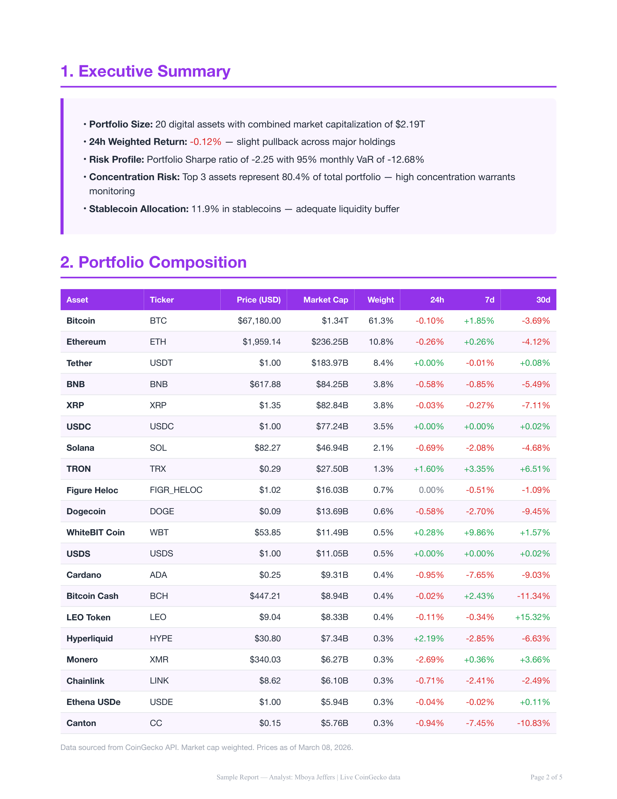
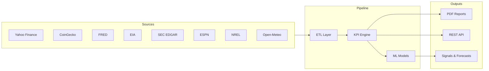
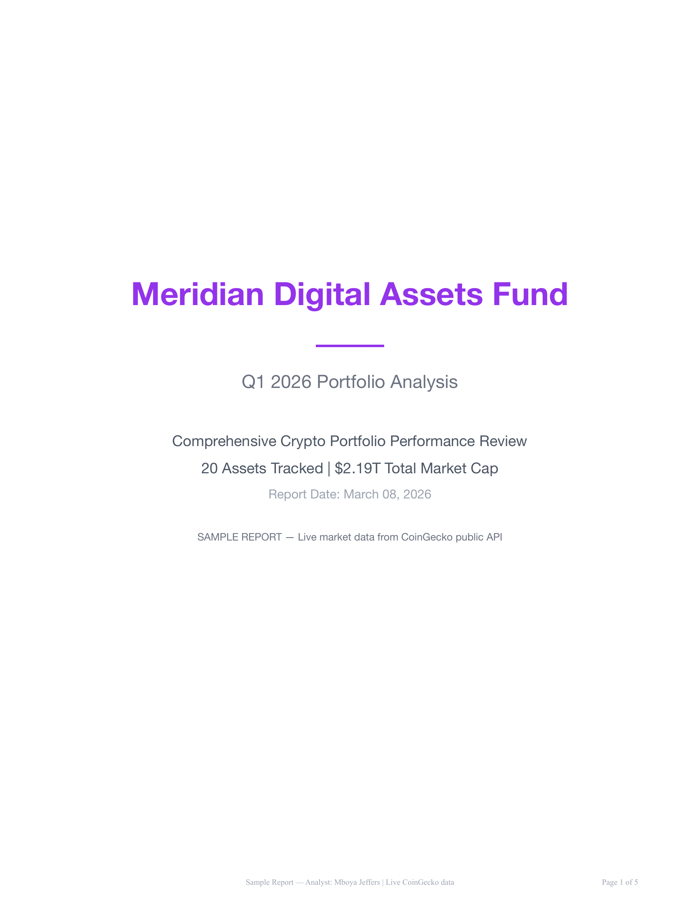
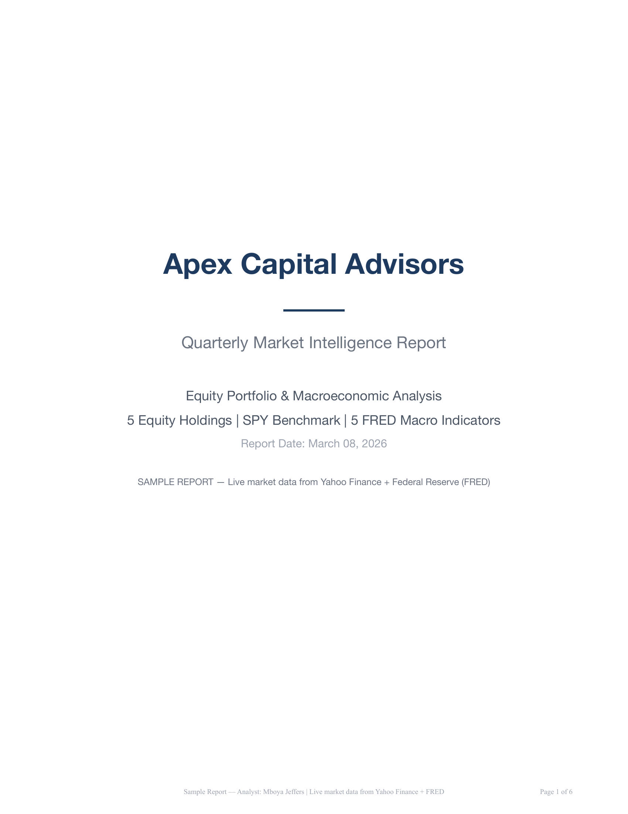
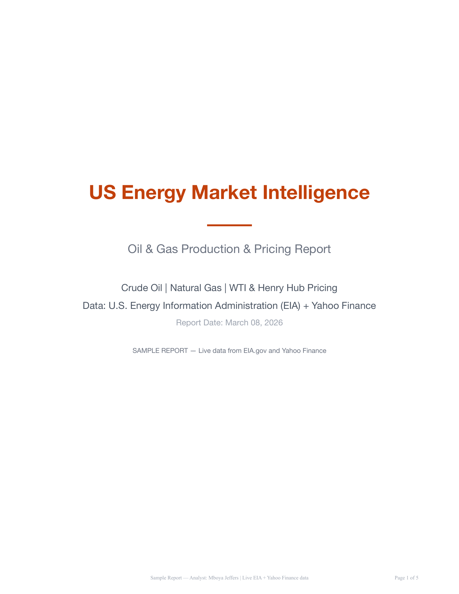
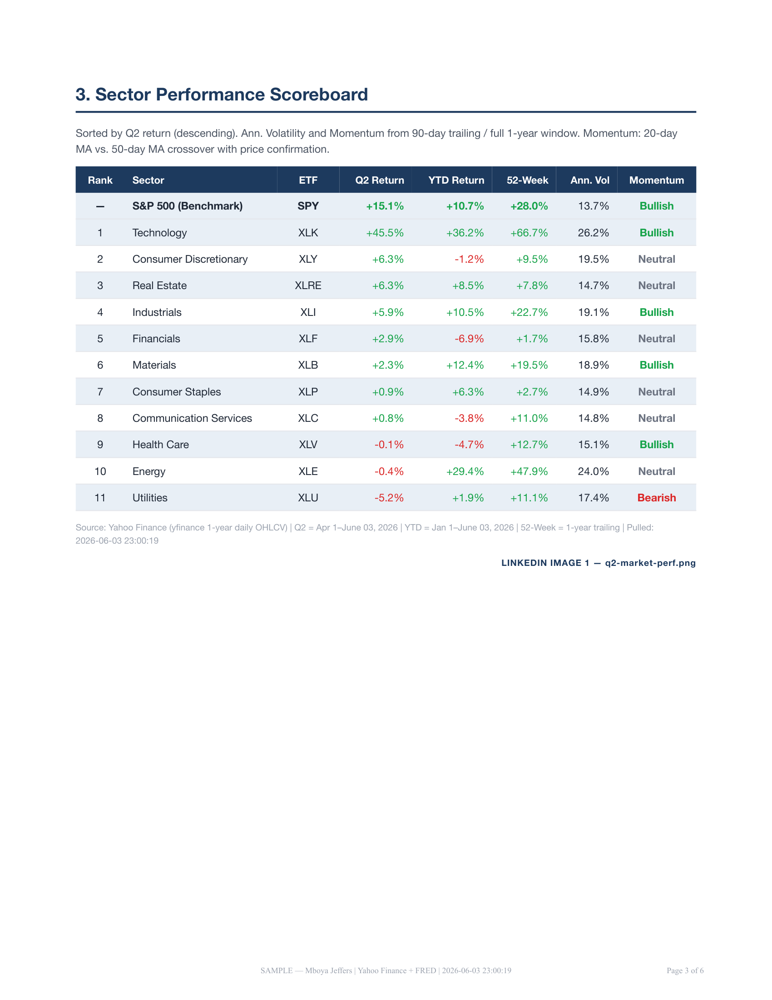
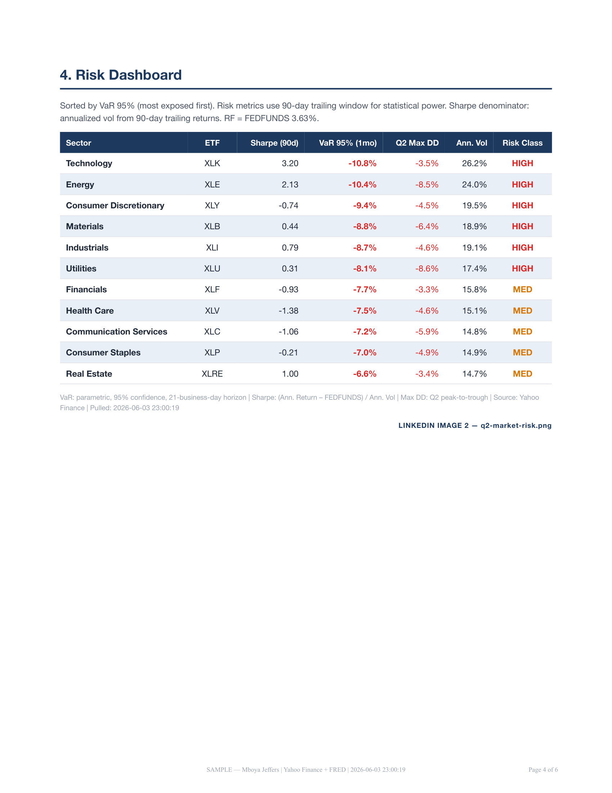

# Market Intelligence Platform

**Live data. Automated reports. Institutional-grade analytics across finance, crypto, energy, and more.**

---

## What It Does

Pulls live data from 8+ public APIs, runs it through a custom KPI layer, and generates institutional-grade PDF reports automatically. What a 10-person analyst team produces manually, this does on a schedule. Reports ship to clients as branded PDFs — no dashboard login required.

---

## Live Data Sources

| Source | Data |
|--------|------|
| Yahoo Finance | Equities, ETFs, commodities |
| CoinGecko | Crypto market cap, volume, pricing |
| FRED | Macro: rates, inflation, employment |
| EIA | Oil & gas production, commodity data |
| SEC EDGAR | 10-K, 10-Q, 8-K filings |
| ESPN API | NFL, NBA, MLB, NHL |
| NREL | Solar generation, renewable energy |
| Open-Meteo | Weather forecasting, climate data |

---

## Verticals Covered

Finance · Crypto · Oil & Gas · Solar · Sports · Compliance/SEC · Gaming · Media · Weather

---

## Architecture

---

## Sample Reports

| Crypto | Finance | Energy |
|--------|---------|--------|
|  |  |  |
| [Q3 Portfolio Analysis](reports/crypto/Meridian_Crypto_Q3_2025_Portfolio_Analysis.pdf) | [Weekly Market Pulse](reports/finance/Apex_Capital_Weekly_Market_Pulse_2025-11-21.pdf) | [Monthly Production Report](reports/energy/Sentinel_Energy_Monthly_Production_2025-11.pdf) |
| [Weekly Snapshot](reports/crypto/Meridian_Crypto_Weekly_Snapshot_2025-11-21.pdf) | [Monthly Portfolio Review](reports/finance/Apex_Capital_Monthly_Portfolio_Review_2025-11.pdf) | |
| [Monthly Review](reports/crypto/Meridian_Crypto_Monthly_Review_2025-11.pdf) | [Q3 Comprehensive Analysis](reports/finance/Apex_Capital_Q3_2025_Comprehensive_Analysis.pdf) | |

**Q2 Sector Performance:**

| Performance | Risk Dashboard |
|-------------|----------------|
|  |  |

See also: [Platform Capabilities Overview](reports/platform/Data_Platform_Capabilities.pdf)

---

## Scale & Quality

- **20M+ rows** of verified market data
- **8 integrated** live data sources
- **500+ automated tests**
- Deployed on **GCP** — live 24/7
- **ML layer:** swing trading signals, time-series forecasting, anomaly detection

---

## Stack

Python · PostgreSQL · Flask · GCP Compute Engine · Google Cloud Storage · scikit-learn · Prophet · Pandas · Nginx · Prometheus

---

## For Partners & Buyers

If you're a fund, exchange, or data-driven business looking for automated market intelligence — reach out. Embedded retainers and white-glove packages available.

More samples: [github.com/mboyajeffers/data-reports-showcase](https://github.com/mboyajeffers/data-reports-showcase)

---

See [CAPABILITIES.md](CAPABILITIES.md) for a full vertical-by-vertical breakdown.
